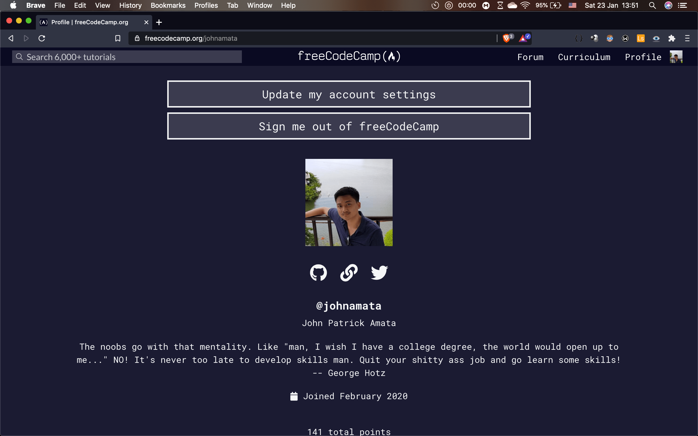

<h1>freecodecamp</h1>

<h2>Description</h2>

This repo contains my solutions to the freeCodeCamp web development curriculum as well as some mini JS/HTML/CSSprojects done for my learning purposes. freeCodeCamp is a popular web development learning program (see <a href="https://www.freecodecamp.org/">freecodecamp.org</a>) that has its students go through lessons, each with exercises, and then do several projects to earn a "certificate" in different areas of software development, most of which are related to web development.

<h2>Tech Stack</h2>

JavaScript, HTML/CSS

<h2>Link(s)</h2>

code: <a href="https://github.com/johnamata/freecodecamp">github.com/johnamata/freecodecamp</a>

<h2>Pic(s)</h2>

> Screenshot taken on January 23, 2021. My freecodecamp learner profile.

