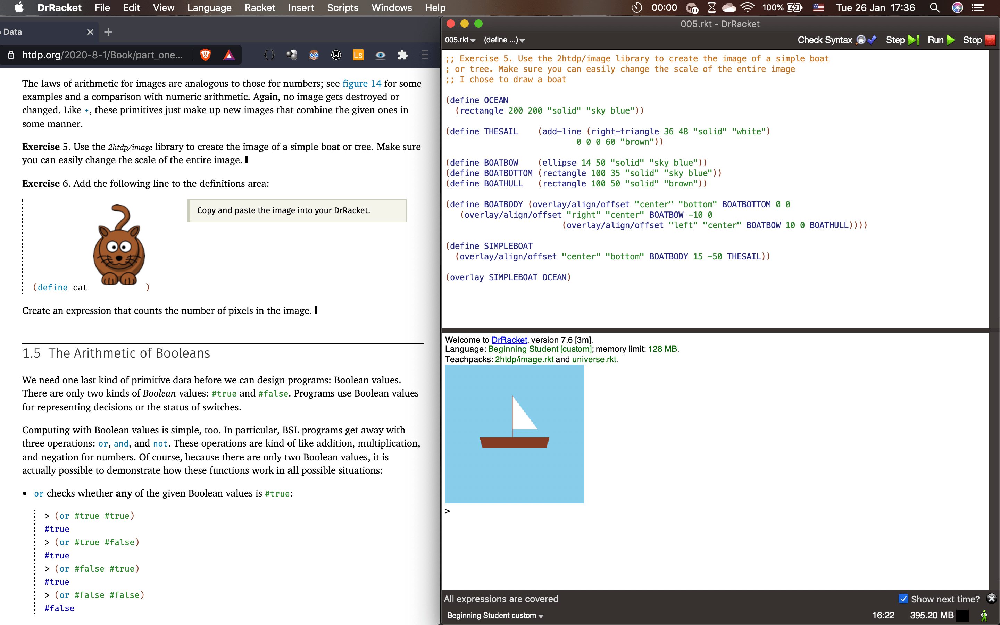

<center><h1>computer science</h1></center>

<p align="justify">This repo contains my solutions for the books <a href="https://htdp.org/">How to Design Programs (HtDP)</a> and <a href="https://mitpress.mit.edu/sites/default/files/sicp/full-text/book/book.html">Structure and Interpretation of Computer Programs</a> (SICP aka "the wizard book"). I started HTDP after getting inspired from a <a href="https://old.reddit.com/r/PinoyProgrammer/comments/kkghxi/please_help_me_decide_where_to_start/ghcpi0l/">reddit thread</a> (here's an <a href="https://archive.is/VqiyS">archived link</a>) where OP asks for some advice on how they could get started with programming and one dude replied to do HtDP. After some searching and reading the website and the other courses from its authors, I decided to stick with it and so far I have learned a lot.</p>

<p align="justify">As for doing SICP, it's merely because <a href="https://boards.4channel.org/g/catalog">4chan /g/</a> likes to meme and recommend it a lot. It's not my focus at the moment although it does give me a nice break from the "grind" nature of the HtDP text and exercises.</p>

<p align="justify">My goal for this year (2021) is to do HtDP, perhaps in 2022 I'll make doing SICP my goal.</p>

<h2>Link(s)</h2>

code: <a href="https://github.com/johnamata/computer-science">github.com/johnamata/computer-science</a>

<h2>Pic(s)</h2>

<p>> Screenshot taken on January 26, 2021. Left window is a browser showing the htdp online book. Right window is the DrRacket IDE showing my solution and output to HTDP's exercise 5</p>


<h2>Things Learned</h2>

<center><p><big>How to Design Programs</big></p></center>

These are notes I took while going through the book and its exercises.

COMPOSITION and AUXILIARY
- Typically, programs consist of a main function as well as other programs that turns the output of 1 function as input for another
- this is called COMPOSITION, in analogy to algebra
- and the additional functions are called AUXILIARY FUNCTIONS

DEFINE ONE FUNCTION PER TASK
- one function per task and one main function that puts it all together
- to get small programs and composition that’s easy to understand
- organized collection of small functions are easier to work with than a large MONOLITHIC block
- see page 60 for an example of how a problem was broken down

MAGIC NUMBERS
- give NAMES to constant numbers so future code readers would know where that number is from, dont just do something like

```racket
(define (attendees ticket-price)
        (- 120 (* (- ticket-price 5.0) (/ 15 0.1))))
```

- instead, do something like the ff, the usefulness will be seen more effectively in a larger codebase

```racket
(define NUMBER_ATTENDEES 120)
(define PRICE_OF_TICKET 5.0)
(define ATTENDANCE_CHANGE 15)
(define PRICE_DOWN 0.1)

(define (attendees ticket-price)
        (- NUMBER_ATTENDEES (* (- ticket-price PRICE_OF_TICKET) (/ ATTENDANCE_CHANGE PRICE_DOWN))))
```
