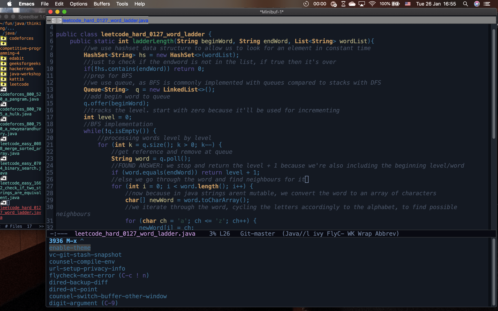

<center><h1>Thinking</h1></center>

<p align="justify">A project of mine to develop my computational thinking. For this one, I am focusing on the algorithmic side of computational thinking, and had thus started going through algorithmic programming problems to sharpen it. I mostly did my work in Java, and some in C++ to study it. O found it to be a great way to learn some built in libraries in the language, specifically those for sorting and parsing.</p>

<p align="justify">If you go through my code, you'd notice that plenty of them have comments detailing what is happening, my thinking at the time, and things I've learned from doing the problem. Some even have comments for every line of code like the screenshot from the thumbnail. It is ugly to look at but those are purely for my learning benefit</p>

<h2>Link(s)</h2>

code: <a href="">github.com/johnamata/thinking</a>

<h2>Pic(s)</h2>

HD version of the thumbnail from project page, a screenshot from jan 26, 2021:


<h2>Things Learned</h2>

<center><p><big>Java</big></p></center>

Some of the things I've learned from going over the algo problems i've solved here in Java

import

- essentials:

```java
import java.io.*;
import java.util.*;
```

input

- hasNext()
- Character.getNumericValue()
- Integer.parseInt()
- Double.parseDouble()
- fastio templates: http://neerc.ifmo.ru/trains/information/Template.java
- other fastio templates to get inspo from: see Java submissions of <a href="https://codeforces.com/profile/Petr">Petr</a> <a href="https://codeforces.com/profile/eatmore">eatmore</a>

Numbers

- if number is over 2 billion value (either positive/negative), go with double or start thinking about bigintegers
- getting number of digits in a number, we can convert it to strings or use logarithms

```java
//best use is String.valueOf() as we dont need to work with wrappers unlike if we use toString()
//here's a sample code using it for leetcode #1295, find numbers with even number of digits

public int findNumbers(int[] nums) {
        int evenDigits = 0;
        int getDigits = 0;
        for (int i = 0; i < nums.length; i++){
            getDigits = String.valueOf(nums[i]).length();
	    //alternatively, we can use logarithms to get it instead of converting
	    //getDigits = (int)(Math.log10(nums[i])+1);
            if (getDigits % 2 == 0)
                evenDigits++;
        }
        return evenDigits;
}
```

- operations involving integers will have integer results, such as 
- parseInt()
- Math.round()
- Math.ceil()
- Math.floor()
- Math.sin()
- Math.toRadians()
- Math.max(a,b) - returns greater number of 2 parameters
- Math.min(a,b)
- Math.pow(base, exponent)

Strings

- .toLowerCase() and .toUpperCase()
- .strip() - remove spaces. I usually use it like String s = sc.nextLine().strip();
- .equals() - for comparing strings. using == on strings will only compare its memory addresses
- .startWith()
- valueOf()
- contains()
- substring()
- .split() - splits string based on parameter or regex and removes these certain characters. for example, the following code takes an input string of words with spaces, and puts it in an array of strings with just the words (no spaces): **String[] s = in.nextLine().split(" ");**
- .charAt()
- .length() - method call for strings, it's different from just simply .length which is an array property, a common mistake i make

Collections

- Arrays.toString() for printing single arrays
- Arrays.deepToString() for printing multi-dimensional arrays
- .size() count size of hashset
- .isEmpty() check if hashset is empty

datastruc

- static arrays: int[] arr;

- dynamic arrays: it's called ArrayList in Java 

```
ArrayList <Integer> al = new ArrayList <>(); 
```
 
- We can give it a size so it wont resize itself: 

```java
ArrayList <Integer> al = new ArrayList <>(30);
```

- sorting static arrays (ascending): Arrays.sort()

- sorting dynamic arrays (ascending): Collections.sort(list)

- Stack: LIFO. 

```java
Stack <Integer> st = new Stack <>();
```

- Queue: Java doesnt have a queue, we use linkedlist instead. 

```java
Queue <Integer> st = new LinkedList<>();
```

- Deque: double ended queue, the class is called ArrayDeque in Java.

```java
ArrayDeque <Integer> dq = new ArrayDeque<>();
```

- Priority Queue:

```java
PriorityQueue<Integer> pq = new PriorityQueue<>();
```

- Ordered Map: TreeMap

- Unordered Map: HashMap

- Unordered Set: HashSet

```java
HashSet<Integer> hs = new HashSet<>();
```

- Ordered Set: TreeSet

```java
TreeSet<Integer> ts = new TreeSet<>();
```

- Multiset: nothing in Java, instead we implement with TreeMap

datastruc misc

- stack to traverse tree without recursion
- graphs: store them globally
